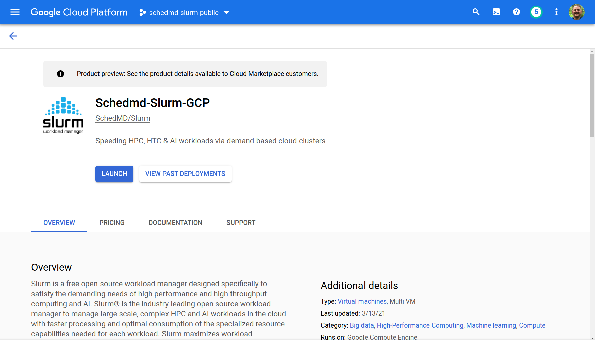
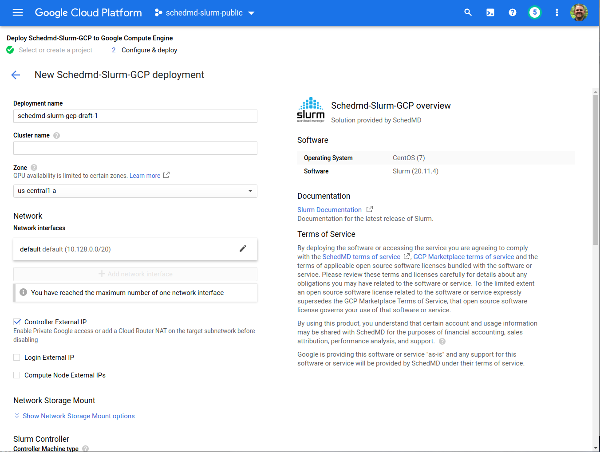
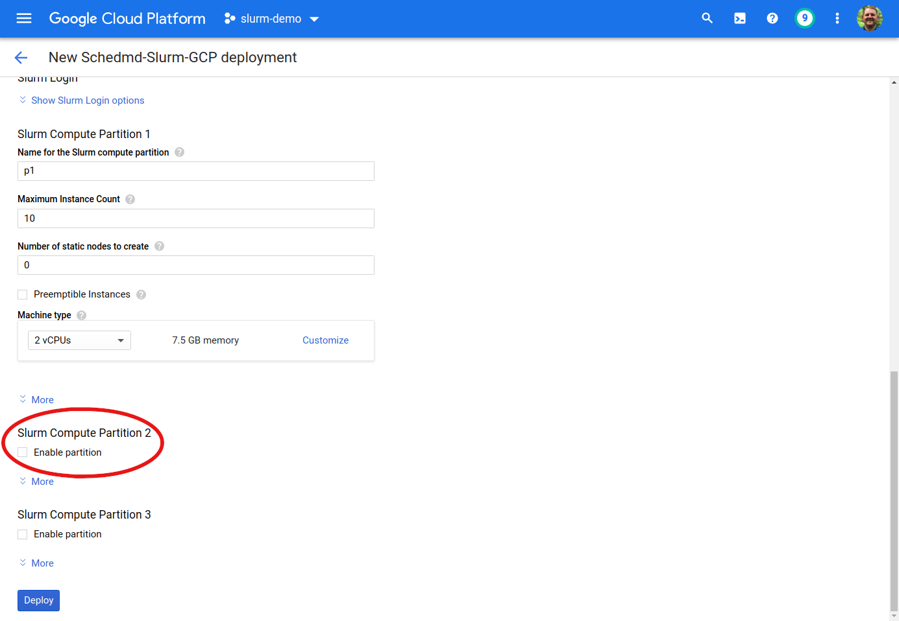
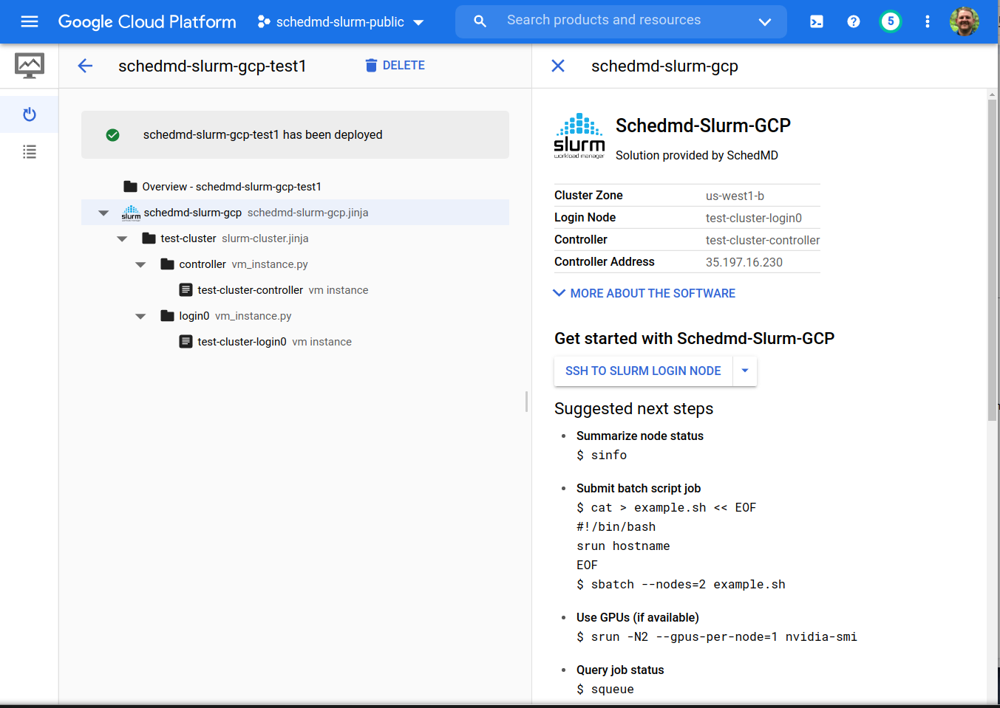
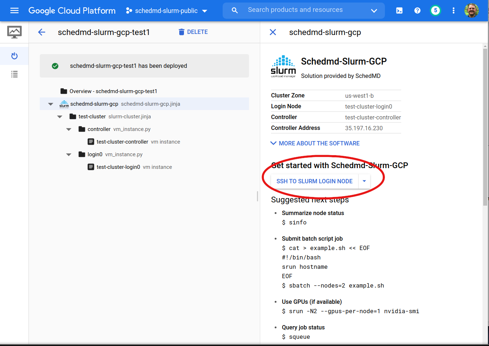
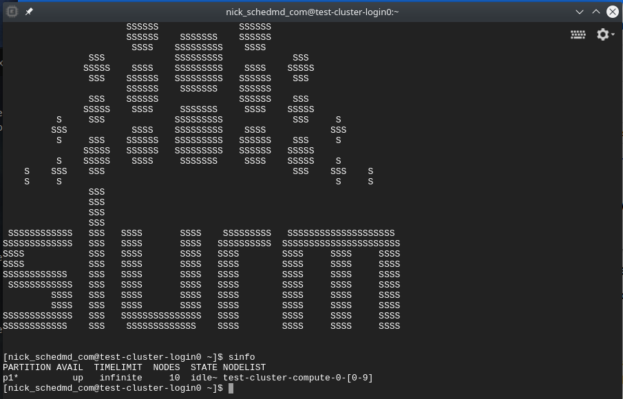
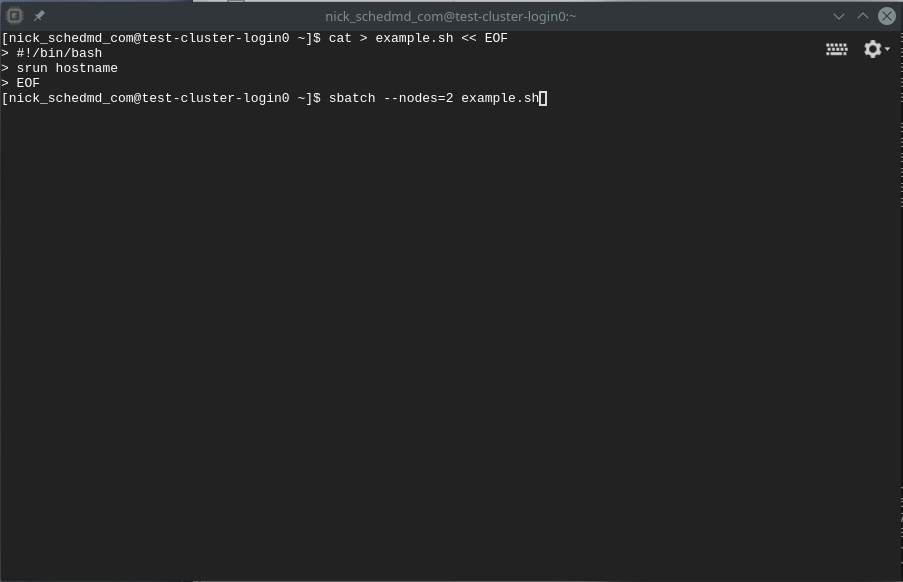
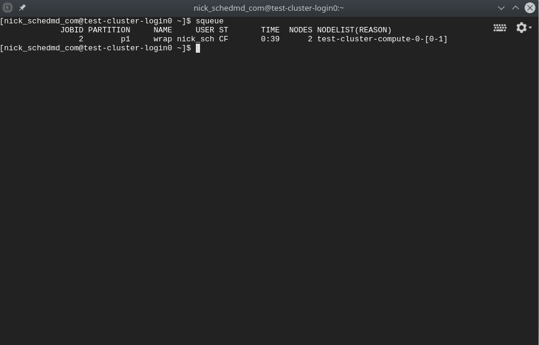
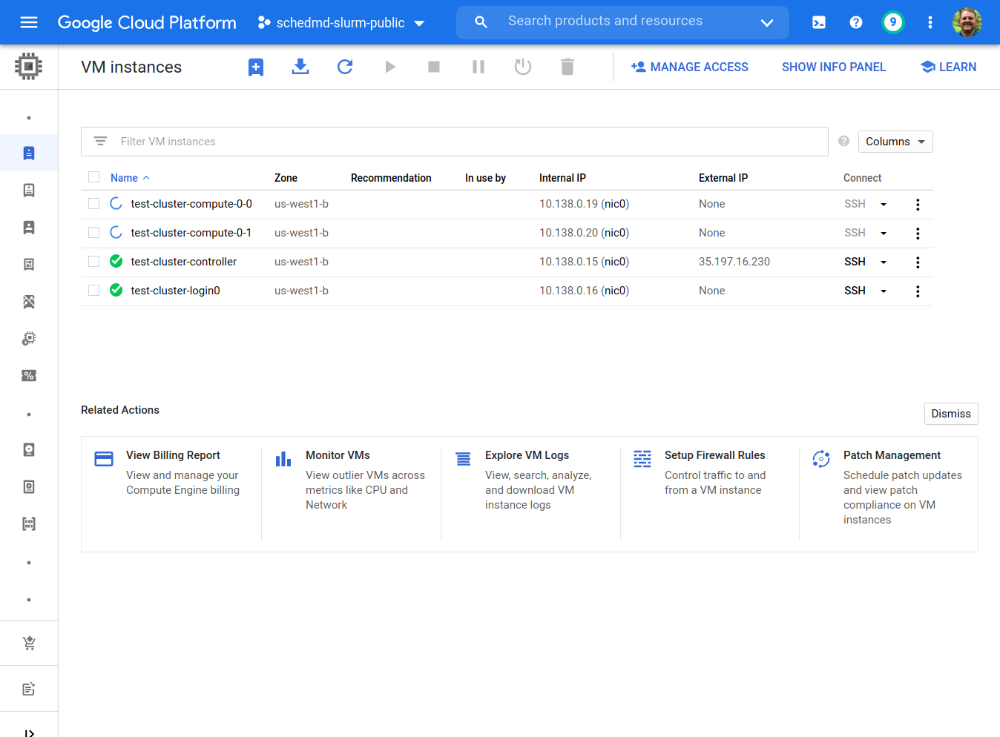

# Google Cloud Marketplace 

## Deploying

1. Go to the SchedMD-Slurm-GCP listing in the GCP Marketplace.  [SchedMD-Slurm-GCP Marketplace](https://console.cloud.google.com/marketplace/product/schedmd-slurm-public/schedmd-slurm-gcp)
 

  

 
2. Click “Launch”.    

  

***
3. Some of the options provide defaults, others require input.  

4. By default, one partition is enabled. Check the box “Enable partition” under the other “Slurm Compute Partition” sections to configure more partitions.  

***
5. When complete, click “Deploy”.

Your Slurm cluster is now deploying.

***
## Using the Cluster

When the deployment is complete, you should see the following:

***
1. SSH to the Login node by clicking the “SSH TO SLURM LOGIN NODE” button.

***
2. Provided are some recommended steps to verify the Slurm cluster is working as expected.
   
   * Summarize node status.

    

   * Submit a batch script job.

   

   * View the job queue.

   
   
   * View the new compute nodes added on the Console.
   
   

